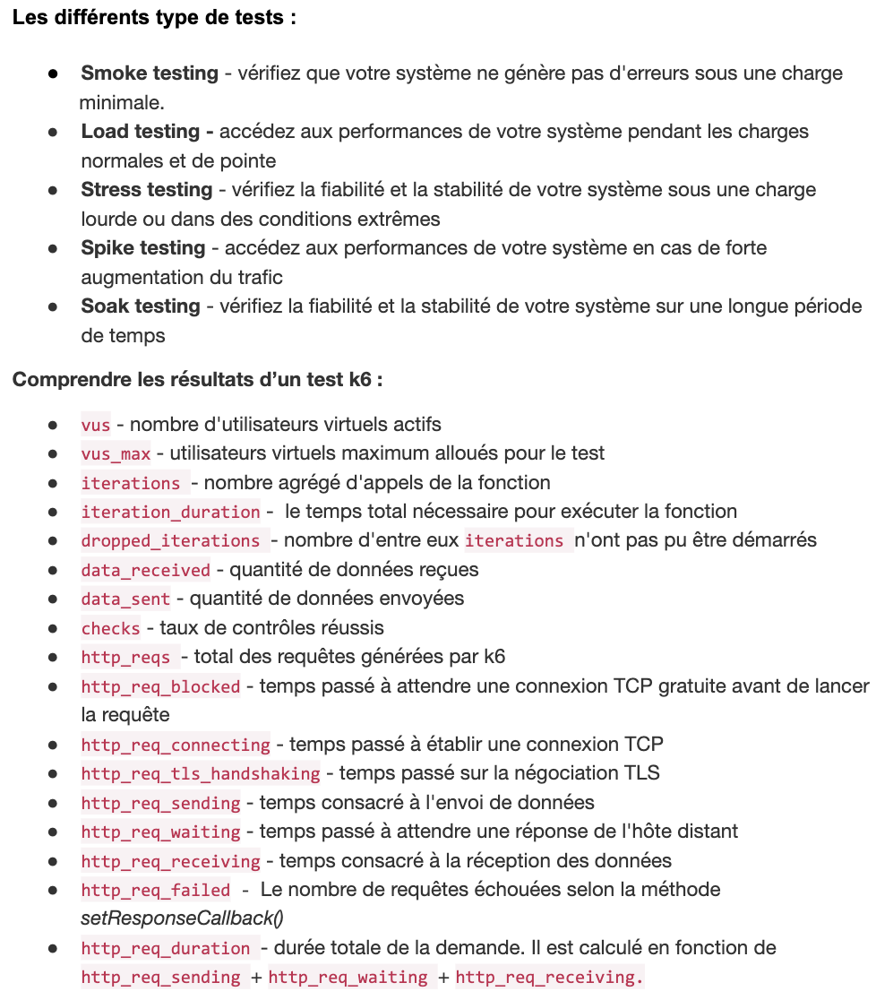
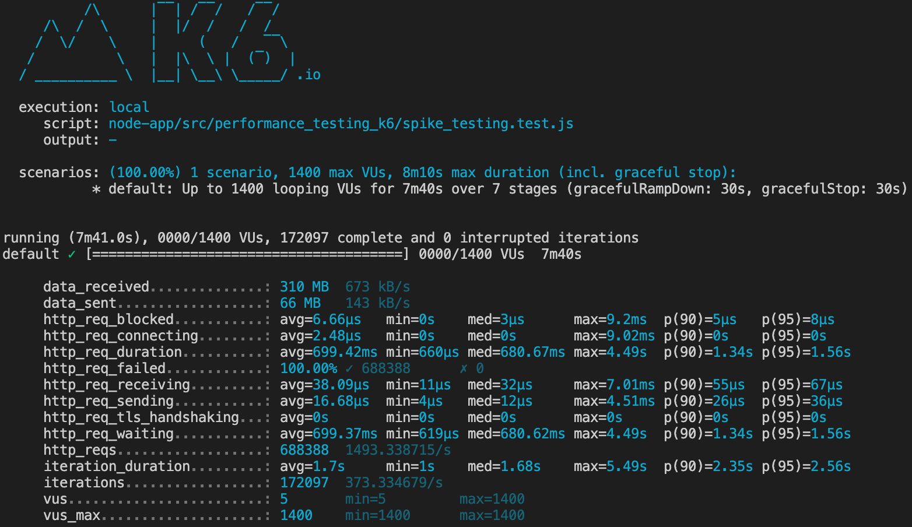

# Green IT

Projet web : Calcul et comparateur d'indice de fragilité des villes de France \
Comment calculer l'indice de fragilité :
- ACCÈS À L’INFORMATION
- ACCÈS AUX INTERFACES NUMÉRIQUES
- CAPACITÉS D’USAGE DES INTERFACES NUMÉRIQUES
- COMPÉTENCES ADMINISTRATIVES

L’unité fonctionnelle sera : la recherche de l’indice de fragilité d’une commune par rapport à son département et sa
région.

Lien en prod (public) : https://green-it-max.herokuapp.com
Lien du github (public) : https://github.com/jules3198/green-it 

Objectifs
- [x] Créer un site internet qui permet d’obtenir un indice de fragilité numérique
- [x] L’application doit tenir sur une seule page web
- [] L’application doit permettre d’introduire l’indice par un texte explicatif et de le terminer sur une phrase de
conclusion
- [] L’application doit permettre une collecte des résultats agrégés :
    -  [] Pour statistique
    - [] Pour ressortir le résultat plus rapidement si même requête
- [x] L’application doit permettre le choix de la commune par son code postal et/ou l’accès à une liste déroulante
- [x] L’utilisateur doit avoir accès aux 4 scores de l’indice, du score global ainsi que de ceux de son département et de
sa région
- [] Le site doit stocker la requête
- [x] BONUS : Possibilité par le site de télécharger un pdf de présentation du résultat final
- [x] BONUS : Effectuer des tests de montée en charge avec K6. Indiquez les résultats dans le readme.

## Choix des tecnhos
LANGAGE
- Javascript : Le javascript est un langage stable, avec un temps d'execution rapide et un taux d'énergie faible. Tout le groupe a une forte connaissance sur ce language.

BACK
- NodeJS :
  Utilisation du framework minimaliste ExpressJS, stable et rapide. L'équipe a de bonne connaissance sur ce framwork.

FRONT
-  ReactJS :
   Pas de biblothèque supplémentaire coté front ( ex : Materialize ). React est une librairie avec une approche basé sur les composants ,
   qui peuvent être facilement réutilisé dans d'autres projets.
   Le fait que React soit une librairie et non un framework ( comme Angular ) le rend plus simple a utiliser et surtout moins volumineux.


## Vos scores dans les outils de benchmark d’éco-conception
- https://institutnr.org/outils-ecoconception-accessibilite 
- https://checklists.opquast.com/en/web-quality-assurance/


## Membres de l'équipe
- DAUDÉ Maxime - mdaude2@myges.fr 5 IWJ
- WELLE Guillaume - guillaume.welle.sio@gmail.com 5 IW1
- GABIAM Jules - julesakouete31@gmail.com 5 IW1
- MBOMBO MOKONDA Christ - christmokonda@gmail.com 5 IWJ

## Lancement du projet (local)
Script Shell de lancement du projet, création et éxéution des dockers, éxécuter la ligne de commande, à la racine du projet :
```
./lancement-project-docker.sh
```
Se rendre sur <http://localhost:3000/>


## Lancement des tests de performance avec k6

### Installation
Linux
Debian/Ubuntu
````
sudo apt-key adv --keyserver hkp://keyserver.ubuntu.com:80 --recv-keys C5AD17C747E3415A3642D57D77C6C491D6AC1D69
echo "deb https://dl.k6.io/deb stable main" | sudo tee /etc/apt/sources.list.d/k6.list
sudo apt-get update
sudo apt-get install k6
````
Fedora/CentOS
````
sudo dnf install https://dl.k6.io/rpm/repo.rpm
sudo dnf install k6
````
MacOS
````
brew install k6
````
Windows ( Chocolatey or  Windows Package Manager)
````
choco install k6
````
````
winget install k6
````

### Execute
```
k6 run node-app/src/performance_testing_k6/<script_filename>
```

### Résultats K6





